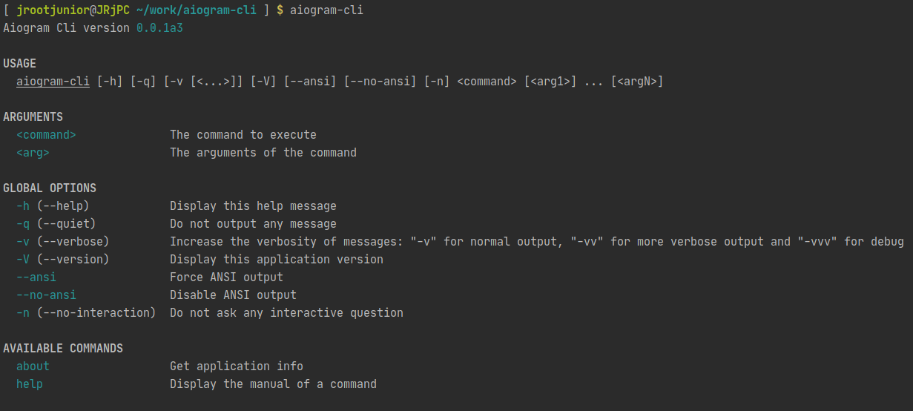
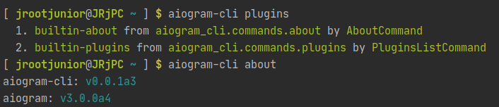

# aiogram-cli

Command line interface for developers

Works only with [aiogram](https://github.com/aiogram/aiogram) 3.0+ (Is under development)

Here is only bootstrap for CLI interface with extensions based on [pkg_resources](https://setuptools.readthedocs.io/en/latest/pkg_resources.html)

## Installation

### From PyPi
`pip install --extra-index-url https://dev-docs.aiogram.dev/simple --pre aiogram-cli`

### Poetry

Add this block to `pyproject.toml` file:
```toml
[[tool.poetry.source]]
name = "aiogram-dev"
url = "https://dev-docs.aiogram.dev/simple"
secondary = true
```

And then run: `poetry add -D aiogram-cli`

## Extensions

- `aiogram_cli_generator` (WIP) - Project files generator based on pre-defined cookiecutter templates
- `aiogram_cli_executor` (WIP) - Executor for bots
- ...

## Usage

Just run in terminal `aiogram-cli` (Or alias - `aiogram`) and see what you can do with it.

## Example






## Writing extensions

Any **aiogram-cli** extension package should provide an entry point like this:
```
[aiogram_cli.plugins]
my_extension = my_package.module:MyCommand
```

Or with poetry like this:
```toml
[tool.poetry.plugins."aiogram_cli.plugins"]
"builtin-about" = "aiogram_cli.commands.about:AboutCommand"
"builtin-plugins" = "aiogram_cli.commands.plugins:PluginsListCommand"
```

This application is based on [cleo](https://cleo.readthedocs.io/en/latest/) framework and that mean all plugins should be one of:
1. subclass of `cleo.Command`
1. instance of `cleo.Command`
1. sequence of subclasses or instances of `cleo.Command`
1. callable which accepts `app: cleo.Application` and returns any of 1-3 formats

Examples:
[aiogram_cli.commands.about](aiogram_cli/commands/about.py)
[aiogram_cli.commands.plugins](aiogram_cli/commands/plugins.py)
